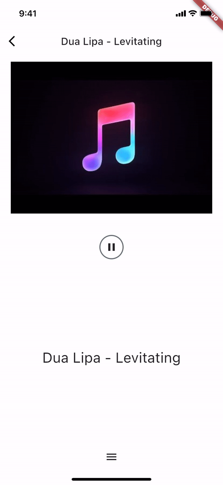

# 🎧 Flutter Podcast Player / Lyrics / Karaoke

A simple Music player that suports auto-scroll for lyrics(.lrc).

This was built-for niche requirement to parse (.lrc) files and karaoke style lyrics scroll on song progress.

Please feel free to fork/contribute/star⭐ the repo if you like what you see😉.

 
<a href="https://drive.google.com/file/d/1qn3F_BpJgQXd4J2Y8uTioBBKpKkv4yz6/view?usp=sharing"></img></a>
 
 

## 📸 ScreenShots 

 

  

## 🔌 Plugins used
| Name | Usage |
|------|-------|
|[**dio**](https://pub.dev/packages/dio)| A powerful Http client|
|[**provider**](https://pub.dev/packages/provider)| State Management|
|[**just_audio**](https://pub.dev/packages/just_audio)| feature-rich audio player for Android, iOS|
|[**cached_network_image**](https://pub.dev/packages/cached_network_image)| Load and cache network images|
|[**just_audio_background**](https://pub.dev/packages/just_audio_background)| add background playback support|
|[**scrollable_positioned_list**](https://pub.dev/packages/scrollable_positioned_list)| ListView + scrolling to a specific item in the list.|
